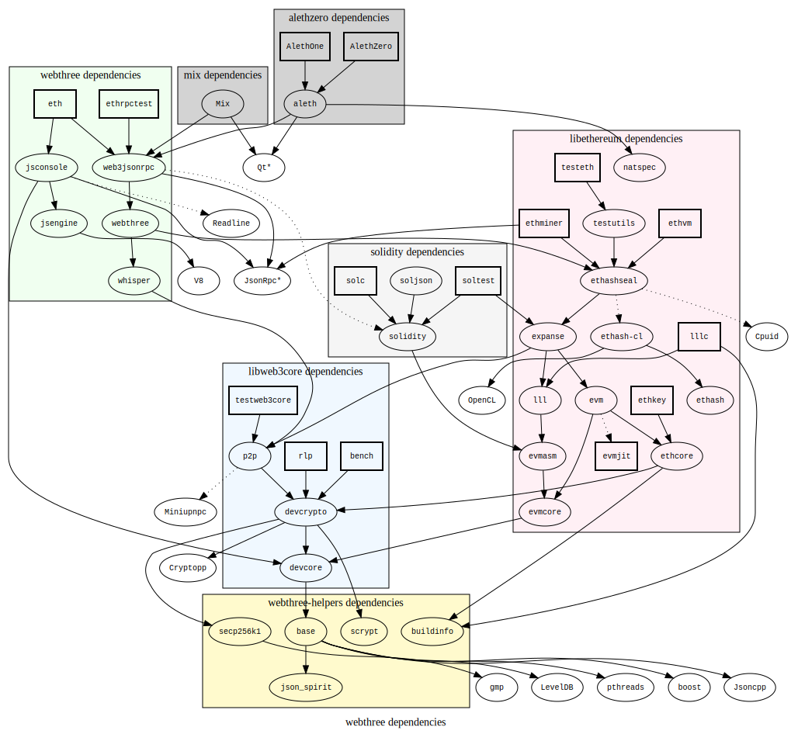
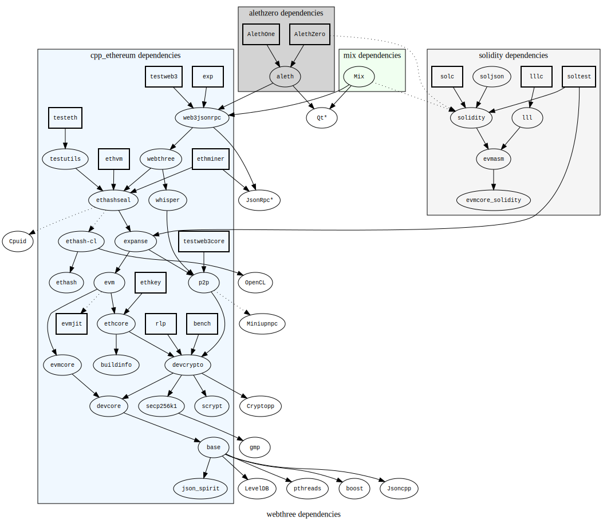

.. _project-reboot:

################################################################################
Project reboot
################################################################################

The project is going through a `reboot under new leadership
<https://blog.expanse.tech/2016/02/12/expanse-dev-update-c-roadmap/>`_.  At
the time of writing, we have a number of moving parts.  Please bear with us!

We `simplified the project naming
<https://github.com/expanse-org/webthree-umbrella/issues/250>`_ at Homestead,
although some naming shadows of the past still linger.  There was a further
`C++ development update <https://blog.expanse.tech/2016/05/04/c-dev-update-announcing-remix/>`_
from Christian in May 2016.

The next big step is our pending `git repository reorganization <https://github.com/expanse-org/webthree-umbrella/issues/251>`_,
which will move our code back into the
`cpp-expanse <https://github.com/expanse-org/cpp-expanse>`_ repository.

We are also
`working toward <https://github.com/expanse-org/webthree-umbrella/issues/530>`_
re-licensing the codebase as `Apache 2.0 <https://tldrlegal.com/license/apache-license-2.0-(apache-2.0)>`_,
which would be the culmination of a very long-term plan to
`liberalize the core <https://github.com/expanse-org/wiki/wiki/Licensing>`_.  An effort was
begun in 2015 to re-license the cpp-expanse core as MIT, but it was never completed.  This
is a revival of that effort, especially with a view towards the potential for collaboration
with the `Linux Foundation <http://linuxfoundation.org>`_'s
`Hyperledger <https://www.hyperledger.org>`_ project.

Current reality (squares are applications, circles are libraries):

Target refactoring:

